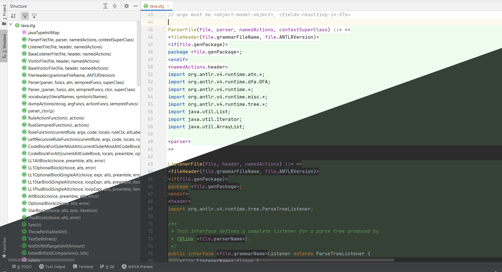
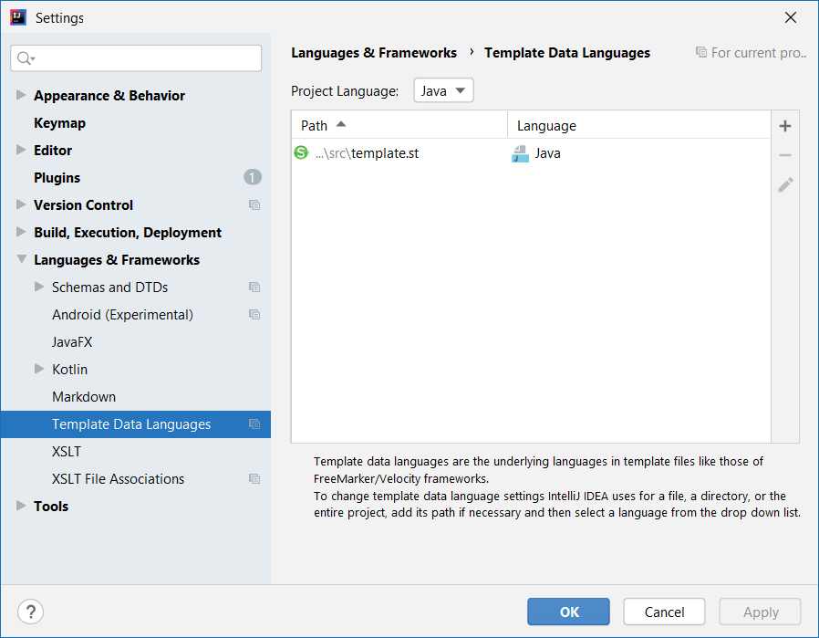
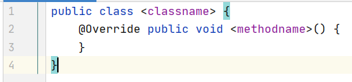

# IntelliJ Plugin for StringTemplate v4 
  

A plugin that adds support for StringTemplate v4 to [IntelliJ](https://www.jetbrains.com/idea/)-based IDEs (version 15.x and later).

It understands `.stg` and `.st` files. For example,

See the [plugin page](https://plugins.jetbrains.com/plugin/8041?pr=) for more information.

# Highlighting the target language

You can configure `Template Data Languages` to make the editor highlight the content around StringTemplate tags.
For example, if your template is used to generate Java code, you can go to `File | Settings | Languages & Frameworks | Template Data Languages`
and configure which language to highlight:

The editor will now highlight Java parts around ST tags:

# Building and contributing

To build the plugin:
`gradlew buildPlugin`

To run the plugin:
`gradlew runIde`

When submitting a pull request, make sure your name is in the `contributors.txt` file.
