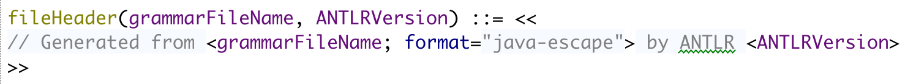
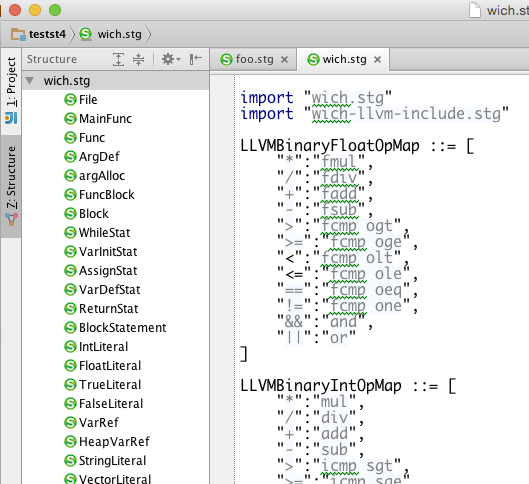
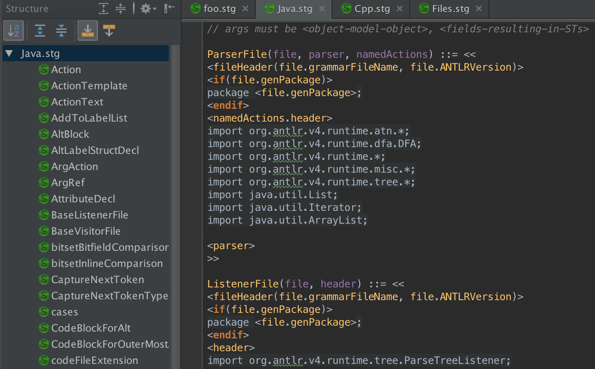

# IntelliJ Idea Plugin for ANTLR v4

An [IntelliJ](https://www.jetbrains.com/idea/) 13.x, 14.x, 15 plugin for StringTemplatev4.

[Plugin page at intellij](https://plugins.jetbrains.com/plugin/8041?pr=)

It understands `.stg` files (not .st files yet). For example,

# Building

For those wanting to build and run this plug-in, you will need to manually
generate the recognizers from the grammars in dir `src/grammars/org/antlr/jetbrains/st4plugin/parsing`.
Using the ANTLR plugin, I right-click and configure ANTLR to make sure
the package is `org.antlr.jetbrains.st4plugin.parsing` then right-click again
and say "Generate ...". It will put the files up in `gen` dir under the root dir.
Then you can build like any other Java code.